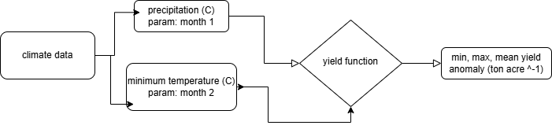

```{r, message=FALSE}
library(tidyverse)
library(here)
library(janitor)
```


```{r, echo=FALSE, fig.cap="Almond yield conceptual model", out.width = '100%'}

```
```{r}
# read in data

data <- read_table(here("clim.txt")) |> 
  clean_names()
```

```{r}
almond_yield <- function(data){
  
  data_filter <- data |> 
    # filter for months January and February
    filter(month == 2 | month == 1) |> 
    
    # turn the daily values into the monthly
    group_by(month, year) |> 
    summarize(mean_min_temp = mean(tmin_c),
              total_precip = sum(precip)) |> 
    ungroup() |> 
    
    # pivot_wider so each row is one year
    pivot_wider(
      names_from = month,
      values_from = c(mean_min_temp, total_precip)
    ) |> 
    
    # remove unneccessary variables
    select(-mean_min_temp_1, - total_precip_2) |> 
    
    # input the values in the given equation
    mutate(yield = (-0.015 * mean_min_temp_2 - 0.0046 * mean_min_temp_2^2 - 0.07 * total_precip_1 + 0.0043 * total_precip_1^2 + 0.28)) 
  
  # set all three results
  yield_results <- c(min_yield = min(data_filter$yield), 
                     mean_yield = mean((data_filter$yield)),
                     max_yield = max((data_filter$yield)))
  
  # return all three results
  return(yield_results)
}

almond_yield(data)
```

In the function we've created, we took the climate data that was given to us and filtered the data to just January and February, as the equation in the paper stated. Our function takes the daily data and mutates it so the values are per month. We then input these new variables into the given equation and set the function to result in the three desired findings: minimum yield, mean yield, and maximum yield. This follows the conceptual model pictured above.
